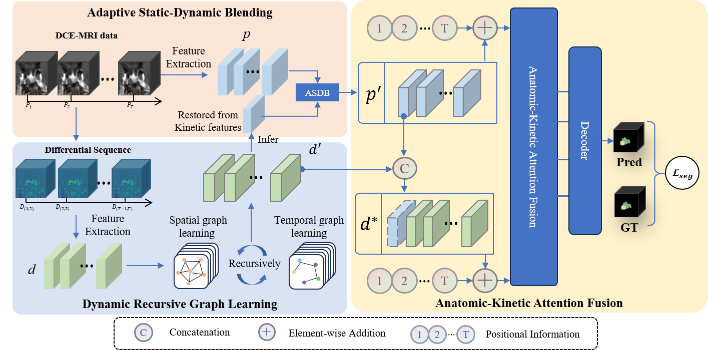

# AKF-Net
Official Code for the paper ["Anatomic-kinetic fusion network for pituitary gland and microadenoma segmentation in multi-phase DCE-MRI"](https://www.sciencedirect.com/science/article/pii/S1566253525005305?via%3Dihub) , presented at `Information Fusion`.

# Introduction
Accurate segmentation of the pituitary gland and pituitary microadenoma (PM) using dynamic contrast-enhanced MRI (DCE-MRI) is crucial in clinical practice. However, effectively leveraging multi-phase DCE-MRI data for precise segmentation remains challenging due to inter-phase variability, missing anatomic details, and the disparities between anatomic and kinetic features in DCE-MRI. In this work, we propose a novel Anatomic-Kinetic Fusion Network (AKF-Net) to address these problems. The proposed AKF-Net makes four main contributions that have been proved to be quite effective in various experiments. First, we introduce a dynamic recursive graph learning method that enables kinetic dependencies modeling between phases while preserving anatomic consistency by iteratively refining its understanding of the relationships between voxels. Second, we propose an adaptive static-dynamic blending module that effectively improves the anatomic feature modeling by integrating multi-phase kinetic information with anatomic features in a residual attention manner. Third, we propose a novel anatomic-kinetic attention fusion module, which resolves the disparities between anatomic and kinetic features by effectively aligning and integrating spatial–temporal features in DCE-MRI, resulting in a robust fused representation that balances spatial detail and temporal dynamics. Fourth, to the best of our knowledge, the proposed AKF-Net is the first work to effectively model hemodynamics features in DCE-MRI by applying spatial–temporal graph learning based on the differential data. The experimental results demonstrate that AKF-Net outperforms existing segmentation methods, achieving state-of-the-art performance.

<p align="center">
  
</p>

### Requirements

- python==3.9
- batchgenerators==0.25
- monai==1.3.1
- numpy 
- scikit-learn==1.5.0
- scipy==1.13.1
- SimpleITK==2.3.1
- tensorboard==2.17.0
- torch==1.12.1
- torchvision==0.13.1
- tqdm==4.66.4

You can install these packages by executing the following command:

```
pip install -r requirements.txt
```

### Dataset
This work uses a private dataset. Due to some factors, only part of the data is given here to test the operation of the code in `dataset/sample_data`.

### Dataset Preparation
#### Data Structure
```
Data Folder/
|
├──train.txt
├──test.txt
├──image/
|  ├──001/
|  |  └──dyn_cor.nii.gz
|  ├──002/
|  |  └──dyn_cor.nii.gz
|  ├──003/
|  |  └──dyn_cor.nii.gz
|  |  ...
|  └──200/
|     └──dyn_cor.nii.gz
└──label/
   ├──001.nii.gz
   ├──002.nii.gz
   ├──003.nii.gz
   |  ...
   └──200.nii.gz
```
#### Train.txt
```
001
002
003
...
```
#### Test.txt(For test and validation)
```
100
101
104
...
```
# How to Us this Code

### Clone this repository:
```bash
git clone git@github.com:PerceptionComputingLab/AKF-Net.git
cd AKF-Net
```

### Training:
- **Step 1.** In the `main_train.py` file, modify the statement `os.environ['CUDA_VISIBLE_DEVICES']` to select the GPU you want to use. For example, set `os.environ['CUDA_VISIBLE_DEVICES']='0'` to use the first GPU.
- **Step 2.** In the `config.py` file, modify the key named `dataset_path` to specify the data path
- **Step 3.** Set the training parameters in the `config.py` file
- **Step 4.** Execute the command to perform training
```bash
python main_train.py
```

### Inference:
- **Step 1.** The breakpoints of the model training will be saved in the `runs` directory. Select the absolute path of the model breakpoint to be inferred and copy it to the `checkpoint_path` field in the `config.py` file.
- **Step 2.** In the `main_test.py` file, modify the statement `os.environ['CUDA_VISIBLE_DEVICES']` to select the GPU you want to use.
- **Step 3.** Execute the command to perform inference
```bash
python main_test.py
```

# Citation:
```
@article{li2026anatomic,
  title={Anatomic-kinetic fusion network for pituitary gland and microadenoma segmentation in multi-phase DCE-MRI},
  author={Li, Xiangyu and Liu, Yifan and Xu, Manxi and Yu, Hongwei and Luan, Jixin and Yang, Aocai and Liu, Bing and Shmuel, Amir and Zhen, Yuan and Luo, Gongning and others},
  journal={Information Fusion},
  volume={125},
  pages={103457},
  year={2026},
  publisher={Elsevier}
}
```